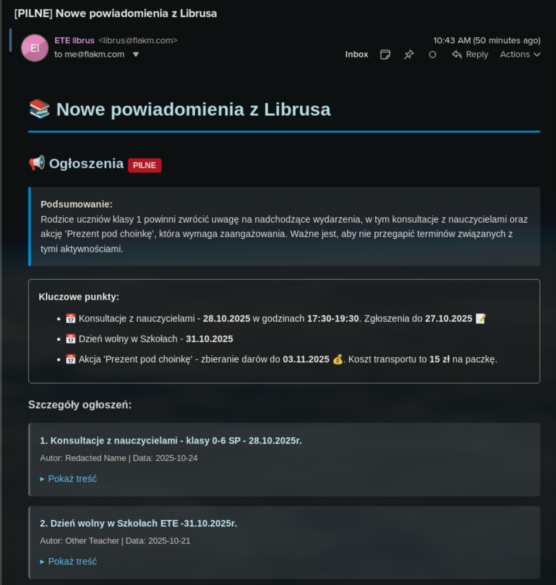

<div align="center">

# 🔔 Czujka Librus

**Inteligentne powiadomienia e-mail z Librusa z analizą AI**

[](https://github.com/FlakM/czujka-librus/actions)
[](https://opensource.org/licenses/MIT)
[](https://nixos.org)

</div>

---

## 📸 Jak to wygląda?



Otrzymujesz **inteligentne podsumowania** z AI, które:
- 📅 Wyróżniają **daty i terminy**
- 🚨 Oznaczają **pilność** (tylko jeśli wymagane działanie)
- 📝 Wyodrębniają **kluczowe punkty** z emoji
- 🔗 Zawierają **bezpośrednie linki** do Librusa

---

## 🚀 Szybki start

### Docker (najłatwiejszy sposób)

```bash
# 1. Skopiuj przykładową konfigurację
curl -O https://raw.githubusercontent.com/FlakM/czujka-librus/main/.env.example
mv .env.example .env

# 2. Edytuj .env - dodaj swoje dane logowania
nano .env

# 3. Uruchom
docker run --env-file .env -v $(pwd)/data:/data ghcr.io/flakm/czujka-librus:latest
```

### Nix

```bash
# Uruchom bezpośrednio z GitHub
nix run github:FlakM/czujka-librus
```

<details>
<summary><b>📦 Inne opcje instalacji</b></summary>

### NixOS (moduł systemowy)

```nix
# flake.nix
{
  inputs.czujka-librus.url = "github:FlakM/czujka-librus";

  outputs = { self, nixpkgs, czujka-librus }: {
    nixosConfigurations.yourhost = nixpkgs.lib.nixosSystem {
      modules = [
        czujka-librus.nixosModules.default
        {
          services.librus-notifications = {
            enable = true;
            environmentFile = "/etc/czujka-librus/credentials.env";
            schedule = [ "*-*-* 07:00:00" "*-*-* 15:00:00" ];
          };
        }
      ];
    };
  };
}
```

Zobacz [NIXOS_MODULE.md](NIXOS_MODULE.md) dla pełnej dokumentacji.

### Node.js (manual)

```bash
git clone https://github.com/FlakM/czujka-librus.git
cd czujka-librus
npm install
cp .env.example .env
# Edytuj .env
npm start
```

</details>

---

## ✨ Funkcje

- 🤖 **Analiza AI** - GPT-4o-mini analizuje ogłoszenia i wiadomości
- 📧 **E-mail z HTML** - piękne, responsywne powiadomienia
- 🎯 **Inteligentna pilność** - AI rozpoznaje co naprawdę wymaga uwagi
- 👨‍👩‍👧 **Multi-recipient** - wysyłaj do wielu odbiorców
- 🗄️ **SQLite tracking** - pamięta co już przetworzył
- ⚙️ **Production ready** - moduł NixOS, Docker, systemd
- 🔒 **Bezpieczne** - security hardening (PrivateTmp, NoNewPrivileges)

---

## ⚙️ Konfiguracja

### Wymagane zmienne środowiskowe

```env
# Librus
LIBRUS_USERNAME=twój_login
LIBRUS_PASSWORD=twoje_hasło

# OpenAI
OPENAI_API_KEY=sk-proj-xxx

# Email
SEND_EMAIL=true
EMAIL_HOST=smtp.fastmail.com
EMAIL_PORT=587
EMAIL_USER=twoj@email.com
EMAIL_PASSWORD=hasło_aplikacji
EMAIL_FROM=Czujka <czujka@twojadomena.com>
EMAIL_TO=odbiorca1@example.com,odbiorca2@example.com
```

<details>
<summary><b>📨 Konfiguracja email (Fastmail / Gmail)</b></summary>

### Fastmail (zalecane)

1. Ustawienia → Hasło i bezpieczeństwo → Hasła aplikacji
2. Utwórz nowe hasło dla "czujka-librus"
3. Użyj głównego emaila jako `EMAIL_USER`
4. Użyj hasła aplikacji jako `EMAIL_PASSWORD`

### Gmail

1. Włącz uwierzytelnianie dwuskładnikowe
2. Konto Google → Bezpieczeństwo → Hasła aplikacji
3. Wygeneruj hasło dla "Poczta"
4. Użyj 16-znakowego hasła jako `EMAIL_PASSWORD`

</details>

---

## 📚 Dokumentacja

- [**Moduł NixOS**](NIXOS_MODULE.md) - pełna dokumentacja wdrożenia NixOS
- [**Development**](CLAUDE.md) - dokumentacja dla deweloperów
- [**Docker Compose**](docker-compose.yml) - przykładowa konfiguracja

---

## 🏗️ Architektura

```
┌─────────────┐      ┌──────────┐      ┌─────────┐
│   Librus    │─────▶│  OpenAI  │─────▶│  Email  │
│     API     │      │ GPT-4o-m │      │  SMTP   │
└─────────────┘      └──────────┘      └─────────┘
       │                   │                  │
       ▼                   ▼                  ▼
  Pobiera dane      Analizuje AI        Wysyła HTML
  2x dziennie      Klasyfikuje         Multi-odbiorca
                   Wyodrębnia
```

**Tech stack:** Node.js 20, SQLite, OpenAI API, Nodemailer, Nix

---

## 🤝 Contributing

Contributions welcome! Zgłaszaj issues, pull requesty lub sugestie.

---

## 📄 Licencja

MIT © 2024

---

## 🙏 Podziękowania

- [librus-api](https://github.com/Mati365/librus-api) - nieoficjalne API dla Librusa
- OpenAI - za GPT-4o-mini

---

<div align="center">

**Zrobione z ❤️ dla rodziców śpiących dzieci**

[⭐ Daj gwiazdkę jeśli pomogło](https://github.com/FlakM/czujka-librus)

</div>
